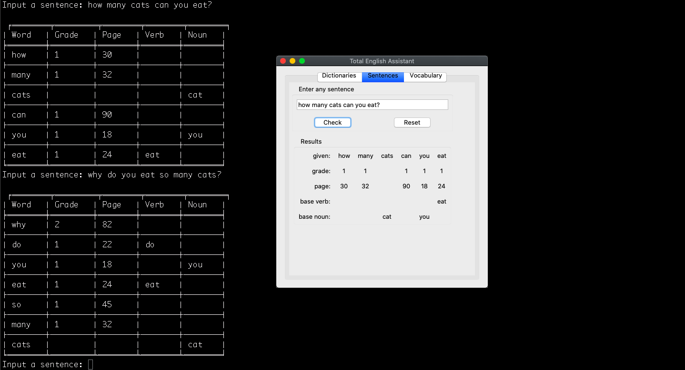

# Total English Assistant
This is a GUI and CLI tool.  
It is intended to be a supplement to the "Total English" book series.  
This textbook series is (in 2019) taught in many of Japan's middle schools.  
_Low priority project. I learned what I wanted to learn from this project and now I need to move on. I don't intend to continue working aggressively on this one._

See the [wiki](https://github.com/wmcooper2/TotalEnglishAssistant/wiki) for more info.

Here is a combined screenshot of the CLI and GUI versions.  
  
Here is a link to the [dictionary version made with React](https://wmcooper2.com/total-english-dictionary-js/).  
And here is the [sentence version made with React](https://wmcooper2.com/total-english-sentence-js/).  


### Operation
1. Create and run your virtual environment:  
```bash
python3 -m venv venv
source venv/bin/activate
```  
2. Run with `./run`


### Purpose
A tool to help me find words in the books to make worksheets and activities faster.

### What I learned
* the trade offs between binary trees and dictionaries
* the "json" module
* the "tkinter" module
* how to combine many small modules into a larger working program
* refactoring function monstrosities using Single Responsibility Principle (SRP)
* how to debug with "pdb" module
* dealing with class inheritance
* consistency across modules, data files, naming variables and functions
* writing tests
* revisting code written over a year ago and making improvements to format, function and speed
* drawing simple diagrams to aid in understanding the code base
* how to assemble my first package in pypi and use the setup.py file
* how to provide ongoing support/maintenance for a program
* how to recognize scope creep and "pull back" from it
* how to convert object oriented design to a functional design
* tradeoffs between OOP and functional programming
